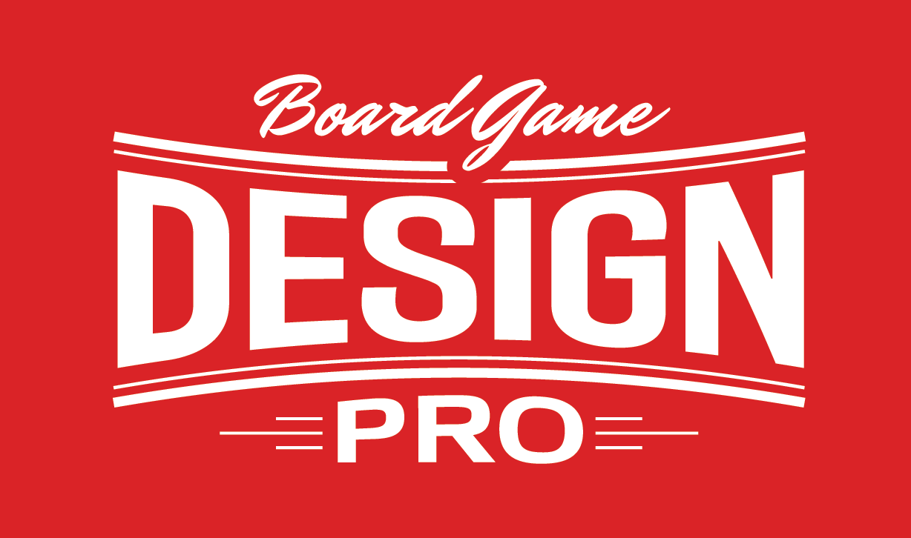

  
  <h1>BG PRO</h1>
  
  

    A board game app designed for statistic hungry nerds
  

 

<!-- Badges -->

## Tools

## Coverage

Reference: https://github.com/dwyl/repo-badges

---

 

<!-- Table of Contents -->

# :notebook_with_decorative_cover: Table of Contents

- [About the Project](#star2-about-the-project)
- [Details](#floppy_disk-details)
- [Contact](#handshake-contact)
- [Acknowledgements](#gem-acknowledgements)

<!-- About the Project -->

## :star2: About the Project

Creating a unique board game experience by tracking your gaming statistics. Challenge your friends for a high score!

## :floppy_disk: Details

Fonts: Asimovian, Lora

## :handshake: Contact

Author: John Lee, Martin Ho

Project Link: [Github](https://github.com/minimartzz/bgpro)

<!-- Acknowledgments -->

## :gem: Acknowledgements

- [header image](https://boardgamedesignlab.com/pro/)
