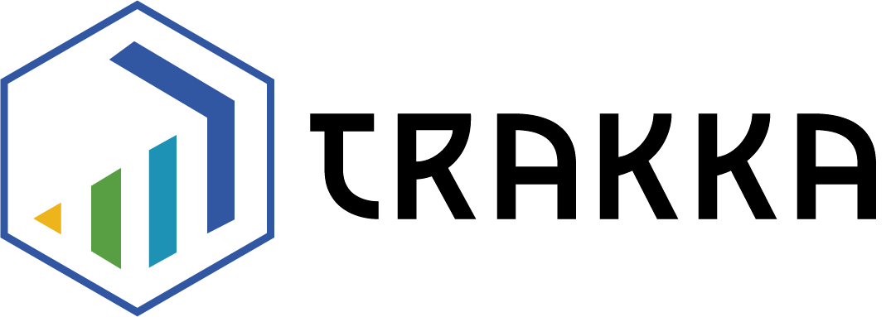
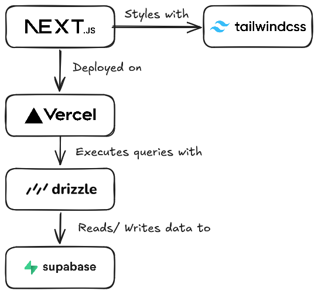

<div align="center">

  <picture>
    <source media="(prefers-color-scheme: dark)" srcset="assets/header_dark.png">
    <source media="(prefers-color-scheme: light)" srcset="assets/header_light.png">
    
  </picture>
  
<br/>
<div align="center">
  <h3>
    A Board Game Tracker for Statistics Nerds!
  </h3>
</div>

</div>

<br />

<!-- Badges -->

## Tools


---

<br />

<!-- Table of Contents -->

# :notebook_with_decorative_cover: Table of Contents

- [About the Project](#star2-about-the-project)
- [Architecture](#building_construction-architecture)
- [Project Structure](#file_folder-project-structure)
- [Setup](#computer-setup)
- [Details](#floppy_disk-details)
- [Phases](#palm_tree-phases)
- [Contact](#handshake-contact)
- [Acknowledgements](#gem-acknowledgements)

<!-- About the Project -->

## :star2: About the Project

Trakka is a board game sessions tracking application with tribe grouping features to track you and your friends performance. Measure your progress, create gaming groups and challenge your friends in your favourite games. The unique ranking feature allows you to compare yourself across all games with others all over the world!

A combination of both my own code and help from Claude

## :building_construction: Architecture

<div align="center">
  
</div>

## :file_folder: Project Structure

```
app/                    # Application code
assets/                 # Assets used in the README
components/             # Typescript components used in the App
db/                     # Supabase and Drizzle schemas
hooks/                  # Hooks used in the App
lib/                    # Collection of interfaces
public/                 # Publically available assets used in the App
utils/                  # Common processing scripts used in the App
```

## :computer: Setup

```bash
# 1. Install all the relevant packages
npm install
yarn install

# 2. Run from project root
yarn dev
```

**Important ENV variables**

- `DATABASE_URL`: Supabase secret connection string
- `NEXT_PUBLIC_SUPABASE_URL`: Supabase public connection string
- `NEXT_PUBLIC_SUPABASE_PUBLISHABLE_DEFAULT_KEY`: Supabase public publishable key
- `NEXT_PUBLIC_SUPABASE_HEADER`: Supabase public connection string without the https (yes, i know this can be better)
- `BGG_TOKEN`: Private token to access BGG API

## :floppy_disk: Details

- Fonts: Asimovian, Lora

## :palm_tree: Phases

- [✅] Phase 1: Working application to record sessions and track metrics
- [In Progress] Phase 2: More community driven features (e.g Public facing pages, report generation)

## :handshake: Contact

Author: John Lee, Martin Ho

Project Link: [Github](https://github.com/minimartzz/trakka)

<!-- Acknowledgments -->

## :gem: Acknowledgements

- Badges: [alexandresanlim](https://github.com/alexandresanlim/Badges4-README.md-Profile) & [Ileriayo](https://github.com/Ileriayo/markdown-badges?tab=readme-ov-file#table-of-contents)
- [Icons](https://www.reshot.com/free-svg-icons/item/email-XJQS73NP4V/)
